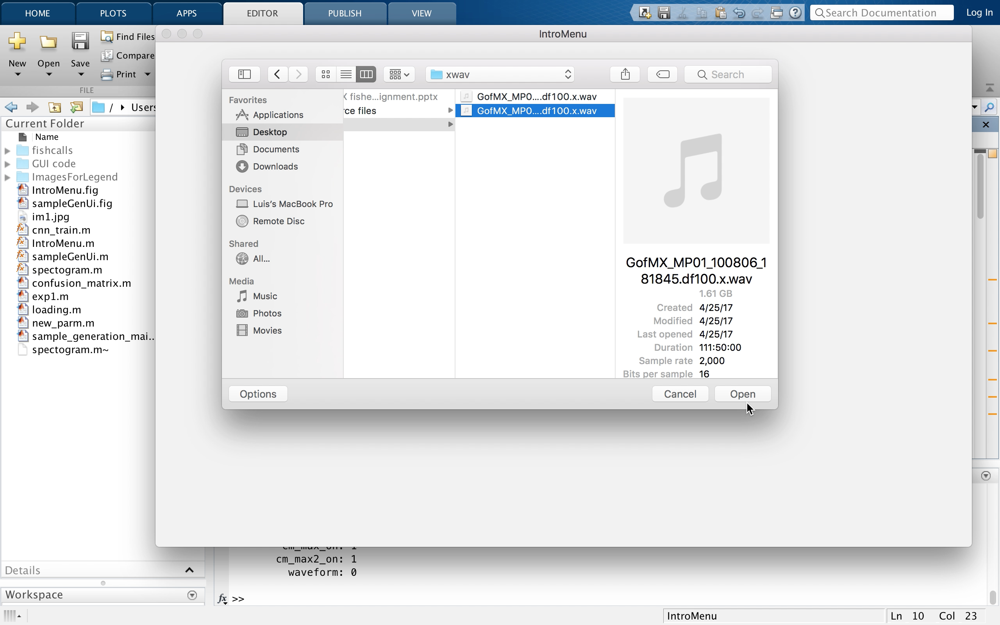
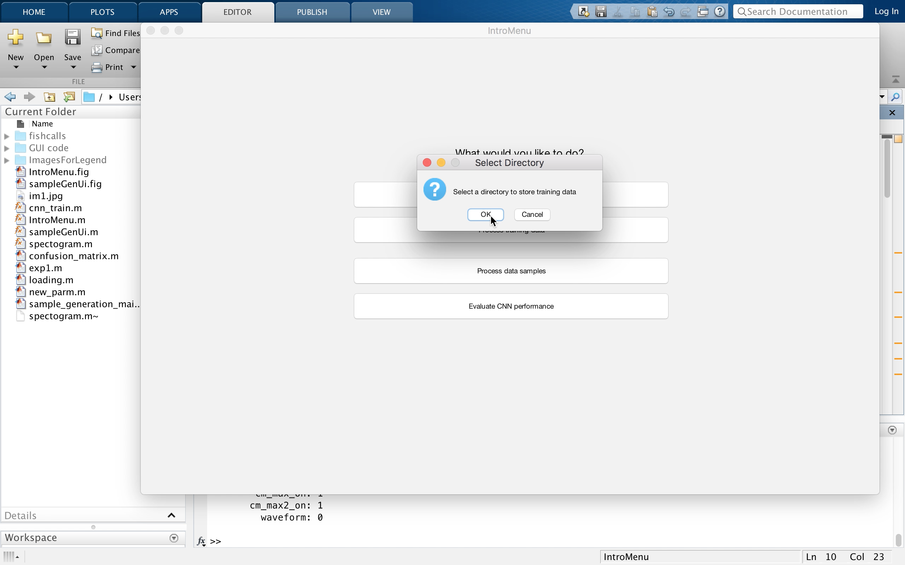
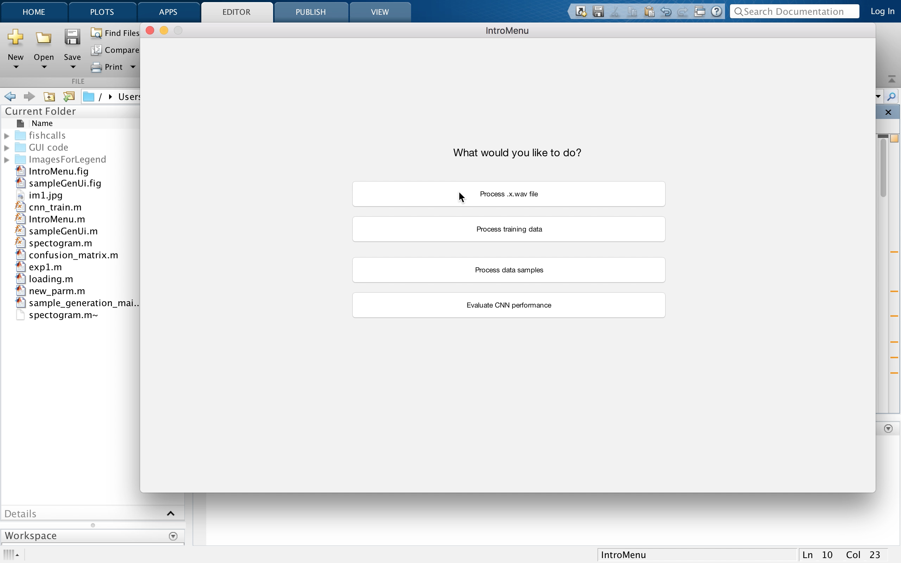
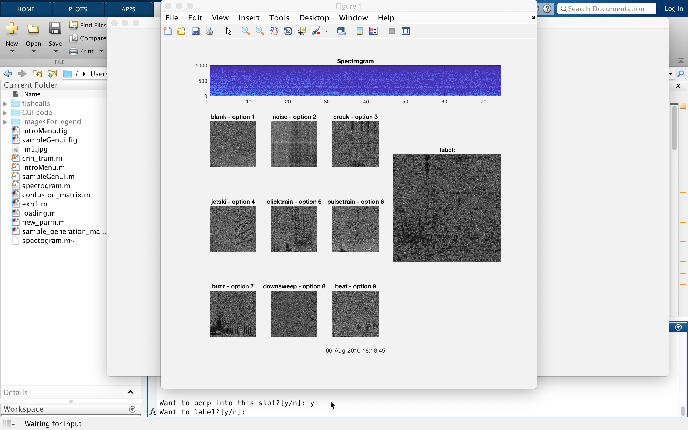
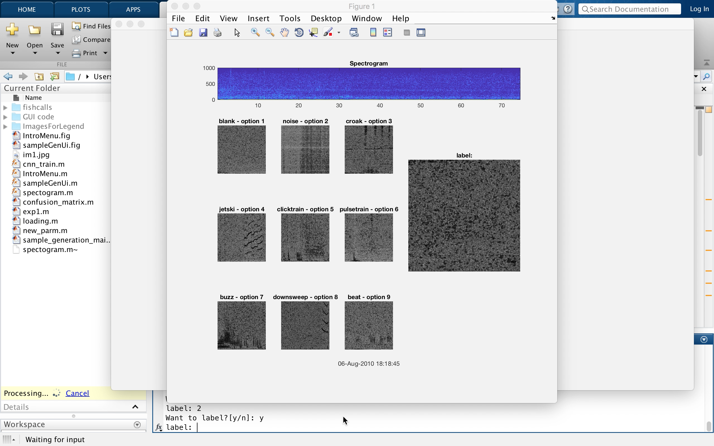

### The original process

The following video demostrates our process on running the original MATLAB code to classify the data before the automation the process.

Before Automation: https://www.youtube.com/watch?v=4ffhX9hXUgY&feature=youtu.be

### Updated progress

### Automating CNN training

The following video demonstrates our process on automating the process.

After Automation: https://www.youtube.com/watch?v=_xXdd6Grit4&feature=youtu.be

### The User Interface (In Progress)

The following video demonstrates our current progress on implementing the graphical user interface.

In Progress GUI: https://www.youtube.com/watch?v=AcMxbM_cuts&feature=youtu.be

